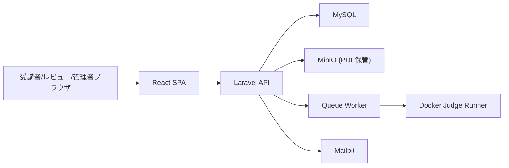

# システム構成設計

## 1. 全体構成

## 2. 技術スタック
- Backend: Laravel 12, Sanctum, Queue(Database)
- Frontend: React 19, TypeScript, React Router, React Query, Tailwind
- Storage: MinIO (S3互換)
- DB: MySQL 8.4
- Mail: Mailpit

## 3. 認証・認可
- 認証: Sanctum Cookie（`auth:sanctum` + CSRF）
- 認可: `EnsureRole` ミドルウェア
- 無効ユーザー制御: `EnsureUserIsActive` ミドルウェア

## 4. 判定基盤
- `RunJudgeJob` が `JudgeRunnerService` を経由して Docker 判定実行。
- ネットワーク無効、リソース制限付きで実行。

## 5. ファイル配信
- PDFは `section_pdfs.file_key` に保存。
- APIから署名URLを払い出してクライアントが表示。
